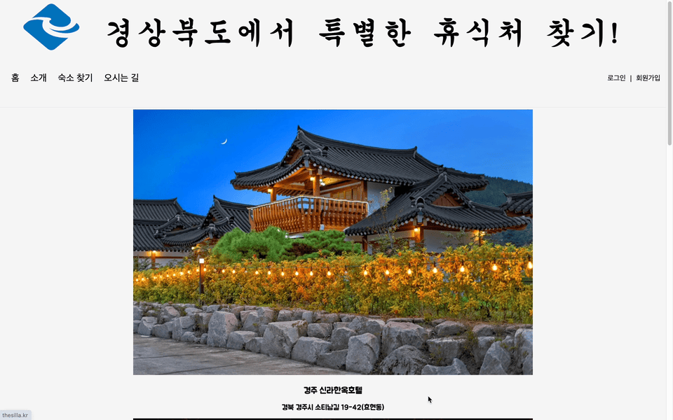

# 경상북도 숙박 찾기 소개
이 프로젝트는 제 첫 번째 개인 프로젝트로, 

경상북도 내 다양한 숙소를 소개하는 프론트엔드 웹 페이지 UI 연습을 목적으로 합니다.
## 🛠 **기술 스텍**
HTML / CSS / JavaScript / jQuery 사용

## 📆 **개발 기간**

**2023.10.30~2023.11.06 (총 1주)**

## 😀 **서비스 기능 소개**

### 메뉴활용 네비게이션 구현

### form + form validation

### API + AJAX 를 사용한 기능 구현
한국관광공사 API 활용 + Naver Map 활용

Google Map API 활용

### 반응형 웹 페이지
 